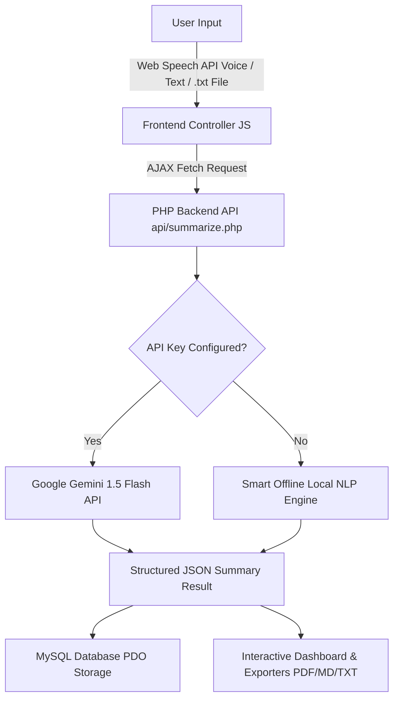

# AI Meeting Minutes Summarizer - College Project Documentation

> **A Full-Stack Web Application** built using **HTML5, CSS3, JavaScript (ES6+), PHP (PDO), and MySQL** with **Dual-Mode AI Engine (Google Gemini API & Smart Offline NLP)**.

[](https://render.com/)

> 🚀 **Deploy on Render**: For step-by-step instructions on deploying this project to Render via Docker, see [DEPLOYMENT.md](file:///c:/xampp/htdocs/ai-meeting-summarizer/DEPLOYMENT.md).

---

## 📌 Project Overview & Abstract

In fast-paced academic and corporate environments, manual record-keeping during meetings is time-consuming and prone to human error. **MinuteAI** automates this process by processing meeting transcripts—via live speech recording or text upload—and automatically generating:
- **Executive Summaries**
- **Action Items & Task Deliverables with Assignees & Due Dates**
- **Key Technical Decisions**
- **Sentiment & Tone Analysis**

---

## 🏗️ System Architecture & Workflow



---

## 💻 Technology Stack

| Component | Technology Used | Description |
|---|---|---|
| **Frontend** | HTML5, Vanilla CSS3, JavaScript (ES6+) | Custom Glassmorphism UI, Responsive CSS Grid/Flexbox, Dark/Light Mode |
| **Voice Engine** | Web Speech API (`webkitSpeechRecognition`) | Browser-native real-time speech-to-text recording |
| **Backend API** | PHP 7.4 / 8.x (PDO Extension) | Modular RESTful API endpoints with JSON responses |
| **Database** | MySQL / MariaDB | Relational database storage with prepared statements |
| **AI Gateway** | Google Gemini API + Offline Rule NLP Engine | Dual-mode AI summarizer with fallback guarantee |
| **Exporters** | JavaScript Blob API, Print Window | Markdown (`.md`), Plain Text (`.txt`), and Printable PDF exports |

---

## ⚙️ Installation & Setup Guide (XAMPP / WAMP / Apache)

### Step 1: Copy Project Files
Place the project directory into your web server's document root:
- **XAMPP**: `C:\xampp\htdocs\ai-meeting-summarizer`
- **WAMP**: `C:\wamp64\www\ai-meeting-summarizer`
- **Linux/Apache**: `/var/www/html/ai-meeting-summarizer`

### Step 2: Database Setup (MySQL)
1. Open **phpMyAdmin** (`http://localhost/phpmyadmin`).
2. Create a new database named `ai_meeting_db`.
3. Import the file `database/schema.sql` located inside the project folder.
4. (Optional) Update database credentials in `config/db.php` if required:
   ```php
   define('DB_HOST', 'localhost');
   define('DB_NAME', 'ai_meeting_db');
   define('DB_USER', 'root');
   define('DB_PASS', '');
   ```

### Step 3: Run the Application
Open your browser and navigate to:
```
http://localhost/ai-meeting-summarizer/
```

> [!NOTE]
> **No MySQL? No problem!** The application features an automatic fallback demo mode. If MySQL is not running during a presentation, the application will seamlessly operate using session state demo storage.

---

## 🗄️ Database Entity-Relationship (ER) Schema

1. **`users`**: Manages user accounts (`id`, `full_name`, `email`, `password`, `role`).
2. **`meetings`**: Stores meeting transcripts and summaries (`id`, `user_id`, `title`, `department`, `meeting_date`, `raw_transcript`, `executive_summary`, `key_points`, `sentiment`, `word_count`).
3. **`action_items`**: Tracks deliverables (`id`, `meeting_id`, `task`, `assignee`, `due_date`, `status`).
4. **`key_decisions`**: Stores agreed decisions (`id`, `meeting_id`, `decision`).

---

## 🎓 College Viva Voce Questions & Answers Guide

### Q1: Why did you choose PHP and MySQL for the backend?
**Answer**: PHP provides lightweight server-side execution with native PDO support for secure SQL prepared statements, ensuring zero vulnerability to SQL injection attacks. MySQL offers efficient relational indexing for linking users, meetings, action items, and key decisions.

### Q2: How does the application function if no internet or Gemini API key is available?
**Answer**: We implemented a **Dual-Mode AI Engine**. If no external API key is supplied, `api/summarize.php` routes the transcript to a custom **offline Natural Language Processing (NLP) engine**. It uses regex heuristics, keyword density, sentence length scoring, and speaker tag parsing to extract summaries and action items locally.

### Q3: How is real-time speech recording handled?
**Answer**: We utilized the HTML5 **Web Speech API** (`window.SpeechRecognition` / `window.webkitSpeechRecognition`). It streams audio directly through browser speech recognition models and updates the transcript DOM in real-time.

### Q4: How is security handled in user authentication?
**Answer**: Passwords are encrypted using PHP’s `password_hash()` with the `PASSWORD_BCRYPT` algorithm. Sessions are initialized safely using PHP session tokens, and input parameters are sanitized.
